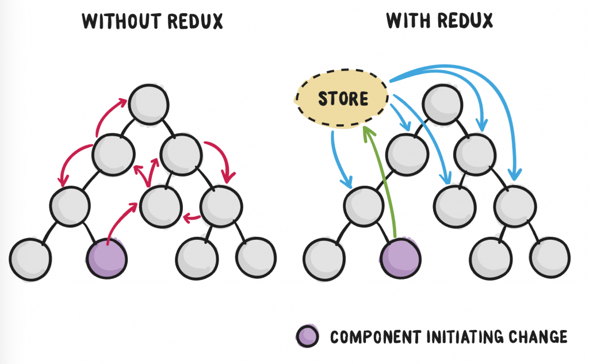
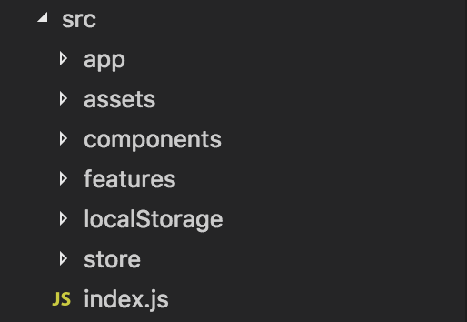
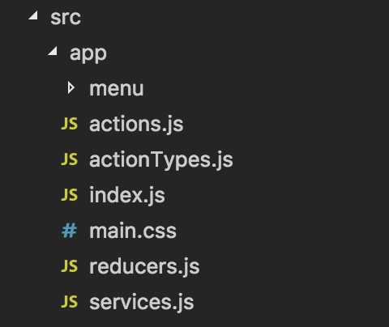
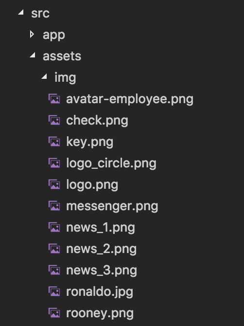
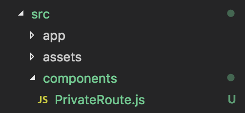
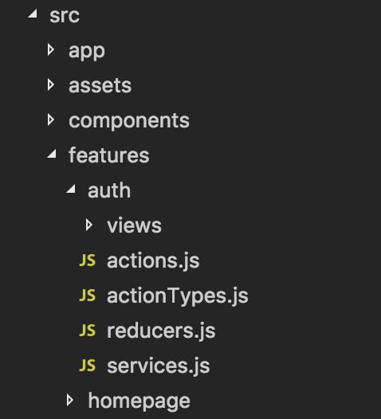
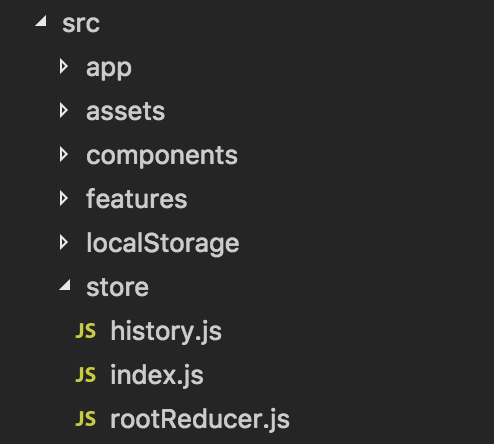

# REACT PROJECT WITH REDUX CONFIGURATION



### Folders Structure

Mô hình React + Redux được xây dựng theo định hướng đơn giản, dễ tiếp cận và tái sử dụng. Với cấu trúc theo chức năng (feature), trang (page) hoặc một yêu cầu củ thể (module). [Tham khảo thêm](https://marmelab.com/blog/2015/12/17/react-directory-structure.html).

Ở đây chúng ta chỉ tập trung vào việc cấu trúc và cách cấu hình của cho project. Để hiểu rõ hơn về Redux được ứng dụng như thế nào trong project, có thể xem [tại đây](./REDUX.md).



Cấu trúc của project bao gồm các thành phần:

- **app**: Nơi quản lý các thành phần như Route, các module được sử dụng ở bất kỳ đâu bên trong website (header, menu, footer, ...).

- **assets**: Thư mục lưu trữ các resource của project (hình ảnh, font, ...).

- **components**: Quản lý các thành phần có thể được tái sử dụng nhiều lần cho các chức năng khác nhau (Button, TextInput, ...).

- **features**: Có tác dụng quản lý các chức năng của website (auth, user, cart, ....).

- **localStorage**: Thư việc hỗ trợ sử dụng local storage của website. Xem thêm về [Local Storage](https://www.w3schools.com/html/html5_webstorage.asp).

- **store**: Nơi khai báo và quản lý các trạng thái của website.

- **index.js**: Nơi khai báo cấu hình website với root HTML tương ứng. 

#### 1. **app** folder



Cấu trúc bên trong `app` folder bao gồm cấu trúc của Redux, nhưng được sử dụng để quản lý các cấu hình cho toàn bộ website. Về cấu trúc Redux có thể xem chi tiết [tại đây](./REDUX.md), chúng ta tập trung vào `index.js`.

```javascript
render() {
  return (
    <div className='container'>
      <Router history={history}>
        <div>
          <Menu />
          <Route
            render={(props) => <HomePage {...props} />}
            exact
            path="/"
          />
          <Route path="/signup" component={CreateCompany} />

          {/* Menu Dashboard user */}
          <Route path="/dashboard" component={DashBoard} />
          <Route path ='/transactionhistory2' component={TransactionHistory2} />
          <ModalPopup />
          <Footer />
        </div>
      </Router>
    </div>
  )
}
```

`index.js` được sử dụng để quản lý các `Route` của website. Bạn có thể xem đây là nơi quản lý layout của website. Có thể thấy trong config chúng ta có `<Menu />`, `<ModalPopup />` (Nơi quản lý các Popup thông báo của trang nếu có), `<Footer />` và các trang của website.

```javascript 
<Route path="/dashboard" component={DashBoard} />
```

Ngoài ra, để khai báo các trang yêu cầu đăng nhập mới được sử dụng. Chúng ta có thể sử dụng một component đã được custom để kiểm tra trạng thái đăng nhập và trả về kết quả tương ứng. 

PrivateRoute.js
```javascript
import React from 'react'
import { Route, Redirect } from 'react-router-dom'
import * as STORAGEKEYS from '../constants/storageKeys'

export const PrivateRoute = ({ component: Component, ...rest }) => (
  <Route
    {...rest}
    render={(props) => (
      localStorage.getItem(STORAGEKEYS.USER_PROFILE) ? <Component {...props} /> : <Redirect to={{ pathname: '/login', state: { from: props.location } }} />
    )}
  />
)
```

Ở đây chúng ta sử dụng `localStorage` để kiểm tra trạng thái đăng nhập và trả về trang được yêu cầu hoặc trang `login` nếu người dùng chưa đăng nhập. Ở `index.js` chúng ta khai báo như sau:

```javascript
<PrivateRoute path="/profile" component={HomePage} />
```

#### 2. **assets** folder



Đơn giản là thư mục dùng để chứa hình ảnh, font, ... của website.

#### 3. **components** folder



Nơi khai báo & quản lý các thành phần có thể được tái sử dụng ở bất kỳ đâu của website. Như trong project, chúng ta có custom Route để dùng cho các trang yêu cầu người dùng đăng nhập.

#### 4. **features** folder



- Như tên gọi của thư mục, đây là nơi để xây dựng và phát triển các chức năng, trang hoặc module của website. 

- Mỗi thư mục con tương ứng với một chức năng, trang hoặc module (auth, homepage, user, ...).

- Mỗi chức năng, trang hoặc module là một cấu trúc Redux riêng biệt bao gồm các thành phần độc lập của Redux. Các thành phần độc lập được combine lại ở `store` folder.

#### 5. **localStorage** folder

```javascript
function getStore(key) {
  return new Promise(async (resolve, reject) => {
    try {
      const data = localStorage.getItem(key)
      if(data) {
        resolve(JSON.parse(data))
      }
    } catch(error) {
      reject(error)
    }
  })
}

function setStore(key, data) {
  try {
    localStorage.setItem(key, JSON.stringify(data))
    console.log(`Set ${key} successfull`)
  } catch(error) {
    console.log(`Set ${key} error is ${error}`)
  }
}

function removeStore(key) {
  try {
    localStorage.removeItem(key)
    console.log(`Remove ${key} successfull`)
  } catch(error) {
    console.log(`Remove ${key} error is ${error}`)
  }
  
}

export {
  getStore,
  setStore,
  removeStore
}
```

Là lớp thư việc hỗ trợ cho việc sử dụng localStorage. 

#### 6. **store** folder



Nơi cấu hình reducer & store cho Redux. Combine những reducer của các chức năng, trang hoặc module.

#### 7. **index.js** file

```javascript
import React from 'react'
import { render } from 'react-dom'
import { Provider } from 'react-redux'

import { store } from './store'
import { App } from './app'

render(
  <Provider store={store}>
    <App />
  </Provider>,
  document.getElementById('root')
)
```

### [YARN](https://yarnpkg.com/en/)

Yarn is a package manager for your code.

[How to install?](https://yarnpkg.com/en/docs/install)

### How to run?

Clone the source from repo, and then run the command line.

```terminal
yarn install && yarn start
```

- `yarn install` sẽ cài đặt các `node_module` được quản lý ở `yarn.lock`. 

- `yarn start` để khởi chạy `node server` và start website.