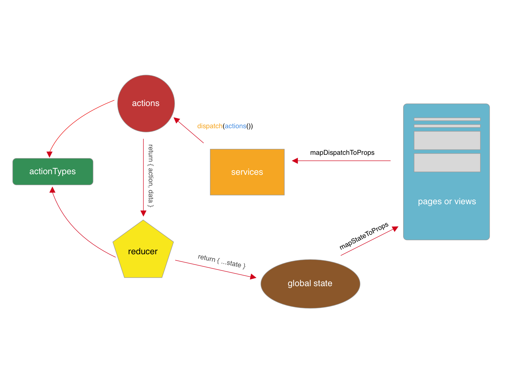
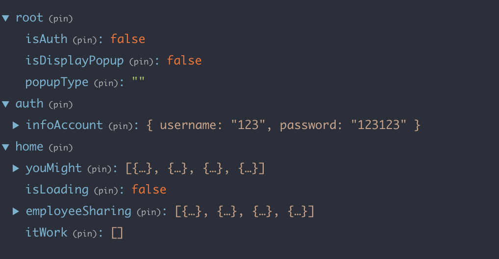

# REDUX

## Documentation


Mô hình React Native, ReactJS và Redux được xây dựng với 6 thành phần cơ bản. 

- **pages (website) hoặc views (mobile)**: Nơi hiển thị nội dung cho người dùng nhìn thấy. Khi người dùng tương tác trên các button, ... Các hành động này sẽ được xử lý ở `services`.

- **services**: Nơi nhận vào các hành động từ `pages` hoặc `views`, sau đó xử lý `logic` và gọi các `actions` bằng hàm `dispatch`.

- **actions**: Giống như một lớp model, nhận vào data và loại hành động từ `services` thông qua hàm `dispatch`, sau đó trả về loại hành động và data cho `reducer`.

- **reducer**: Sẽ nhận vào các loại hành động & data từ `actions`, tùy theo các loại hành động tương ứng, dữ liệu sẽ được cập nhật và `global state`.

- **global state**: Nơi chứa toàn bộ các trạng thái của ứng dụng hoặc website. Khi `global state` thay đổi (được cập nhật lại nhờ `reducer`) thì UI (nơi hiển thị cho người dùng) sẽ được cập nhật lại.

- **actionTypes**: Nơi để khai báo, quản lý các `constants` của Redux.


### 1. page (web) hoặc views (mobile)

Để liên kết các hành động của người dùng trên UI, chúng ta thông qua một hàm `mapDispatchToProps` được  Redux hỗ trợ. Hàm này có nhiệm vụ sẽ kết nối những hàm trong `service` vào trong `props` của page hoặc view.

```javascript
import { initialApp, signIn } from './services'

const mapDispatchToProps = {
  dispatchInitialApp: () => initialApp(),
  dispatchSignIn: (username, password) => signIn(username, password)
}
```

Sau khi đã liên kết các hàm này vào trong `props` của page hoặc view. Chúng ta có thể gọi hàm bằng cách 

```javascript
this.props.dispatchInitialApp()

this.props.dispatchSignIn(username, passowrd)
```

##### Note
- Ngoài ra, có một số tài liệu về Redux không có tầng services (logic), các logic sẽ được xử lý trực tiếp trên page hoặc view. Lúc đó để gọi các `actions` trên view (không cần `mapDispatchToProps`) bằng cách

```javascript
import * as actions from './actions'

dispatch(actions.authencate(true))
```

- Chúng ta không khuyến khích sử dụng cách này. Vì phần UI sẽ rất rối nếu có nhiều hành động sẽ được xử lý trên đó (nhiều button, ...).

Tiếp tục sau khi các hành động đã được xử lý theo quy trình `page hoặc view` => `services` => `actions` => `reducer` => `global state`.

Khi global state cập nhật, thì UI cũng sẽ được cập nhật lại. Để UI biết được khi nào `global state` đã được cập nhật, chúng ta sẽ dũng hàm `mapStateToProps` được Redux hỗ trợ.

```javascript
const mapStateToProps = (state) => ({
  isAuth: state.root.isAuth
})
```

- `state.root`: `state` là `global state`, `root` là reducer. Trong `root` sẽ có các data khác nhau, nhưng tùy vào nhu cầu chúng ta chỉ liên kết các data cần thiết (ở ví dụ là `isAuth`).

- Sau khi đã `mapStateToProps` xong, ở `page hoặc view` muốn sử dụng, chúng ta sẽ gọi ra thông qua `props` của `page hoặc view`.

```javascript
this.props.isAuth
```
hoặc (nên sử dụng cách sau)

```javascript
const { isAuth } = this.props
```


### 2. services

Khi người dùng làm một hành động trên UI (click vào một button, cuộn trang, ...), những hành động này sẽ được `services` xử lý theo logic.

```javascript
function initialApp() {
  return dispatch => {
    ...
    dispatch(actions.initialApp())
    ...
  }
}

function authencate(isAuth) {
  return dispatch => {
    ...
    dispatch(actions.authencate(isAuth))
    ...
  }
}
```


### 3. actions

```javascript
function initialApp() {
  return {
    type: types.INITIAL_APP
  }
}

function authencate(isAuth) {
  return {
    type: types.AUTHENTICATE,
    isAuth
  }
}
...
```

Tầng `services` sẽ gọi các actions thông qua hàm `dispatch`, đồng thời gửi những dữ liệu tương ứng cho các actions này.

```javascript
dispatch(actions.authencate(true))
```

### 4. reducer

Khi `actions` được gọi, nó sẽ trả về loại hành động & data kèm theo. Reducer sẽ kiểm tra loại hành động và cập nhật lại `global state` tương ứng.

```javascript
export function root(state = {}, action) {
  switch (action.type) {
    case types.INITIAL_APP:
      return {
        ...state
      }
    case types.AUTHENTICATE:
      return {
        ...state,
        isAuth: action.isAuth
      }
    default:
      return state
  }
}
```

Ở đây, khi `service` gọi hành động `authencate()` của **actions** thông qua hàm `dispatch`. Reducer sẽ lắng nghe và nhận hành động là `types.AUTHENTICATE`, reducer sẽ trả về dữ liệu tương ứng là

```javascript
return {
  ...state,
  isAuth: action.isAuth
}
```

Biến data `isAuth` này nhận được từ bên hành động `authencate()` của lớp **actions** ở phía trên.

### 5. global state



Như trong hình, chúng ta sẽ hình được `global state` sẽ chứa tất cả những dữ liệu của các `reducer`.

Ví dụ chúng ta có `root` reducer lưu giữ trạng thái đăng nhập của người dùng bằng giá trị `isAuth`. `auth` reducer sẽ lưu giữ thông tin của người dùng bằng phần từ `infoAccount`, ...

Khi 1 trong những `global state` này được cập nhật lại giá trí (Vd: `isAuth` của **root** reducer từ `false` chuyển qua `true`) thì những phần UI có liên quan đến sẽ được cập nhật lại (re-render). 


Như ví dụ trên, ta thấy services sẽ xử lý logic khi website hoặc ứng dụng được mở lần đầu thông qua `initialApp()`. 

Sau đó nếu người dùng đăng nhập thành công, thì `authencate()` sẽ làm nhiệm vụ lưu lại thông qua `dispatch(actions.authencate(isAuth))` để `reducer` cập nhật lại `globale state`.


### 6. actionTypes

```javascript
export const INITIAL_APP = 'INITIAL_APP'
export const LOGIN_SUCCESS = 'LOGIN_SUCCESS'
export const LOGOUT = 'LOGOUT'
...
```
Khi cần thay đổi hay điều chỉnh các `constants`, chỉ cần thay đổi giá trị (value) của các `constants`.

`Reducer` & `Actions` là nơi sử dụng các `constants` này.

## Source

### 1. page hoặc view (index.js)

```javascript
import React, { Component } from 'react'
import { Router, Route } from 'react-router-dom'
import { connect } from 'react-redux'
import './main.css'

import { history } from '../store/history'
import { HomePage } from '../features/homepage'
import { SignIn } from '../features/auth/views/signIn'
import { SignUp } from '../features/auth/views/signUp'

import { initialApp } from './services'
import Menu from './menu'

class App extends Component {

  constructor(props) {
    super(props)
    this.props.dispatchInitialApp()
  }

  render() {
    return (
      <div className='container'>
        <Router history={history}>
          <div>
            <Menu />
            <Route
              render={(props) => <HomePage {...props} />}
              exact
              path="/"
            />
            <Route path="/signin" component={SignIn} />
            <Route path="/signup" component={SignUp} />
          </div>
        </Router>
      </div>
    )
  }
}

const mapDispatchToProps = {
  dispatchInitialApp: () => initialApp()
}

const mapStateToProps = (state) => ({
})

const connectedApp = connect(mapStateToProps, mapDispatchToProps)(App)
export { connectedApp as App }
```

### 2. services (services.js)

```javascript
import { localAuthencate } from '../features/auth/actions'
import * as actions from './actions'

function initialApp() {
  return dispatch => {
    dispatch(actions.initialApp())
    let user = JSON.parse(localStorage.getItem('user'))
    dispatch(actions.loadingLocalStogare())
    if(user) {
      dispatch(actions.authencate(true))
      dispatch(localAuthencate(user))
    } else {
      dispatch(actions.authencate(false))
    }
  }
}

function authencate(isAuth) {
  return dispatch => {
    dispatch(actions.authencate(isAuth))
  }
}

export {
  initialApp,
  authencate
}
```

### 3. actions (actions.js)

```javascript
import * as types from './actionTypes'

function initialApp() {
  return {
    type: types.INITIAL_APP
  }
}

function loadingLocalStogare() {
  return {
    type: types.LOADING_LOCAL_STORAGE
  }
}

function authencate(isAuth) {
  return {
    type: types.AUTHENTICATE,
    isAuth
  }
}

export {
  initialApp,
  loadingLocalStogare,
  authencate
}
```

### 4. reducer (reducers.js)

```javascript
import * as types from './actionTypes'

let initialState = {
  isAuth: false
}

export function root(state = initialState, action) {
  switch (action.type) {
    case types.INITIAL_APP:
      return {
        ...state
      }
    case types.LOADING_LOCAL_STORAGE:
      return {
        ...state
      }
    case types.AUTHENTICATE:
      return {
        ...state,
        isAuth: action.isAuth
      }
    default:
      return state
  }
}
```

### 5. actionTypes (actionTypes.js)

```javascript
export const INITIAL_APP = 'INITIAL_APP'
export const LOADING_LOCAL_STORAGE = 'LOADING_LOCAL_STORAGE'
export const AUTHENTICATE = 'AUTHENTICATE'
```